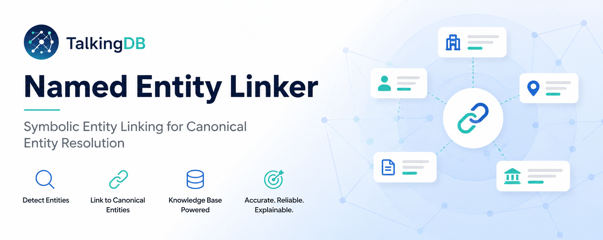
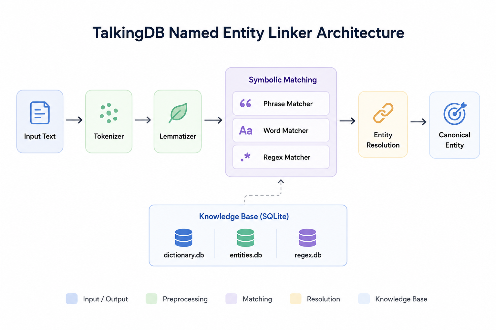
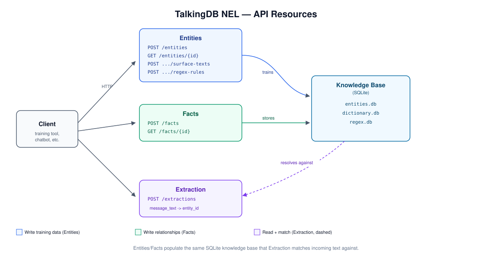

<h1 align="center">TalkingDB Named Entity Linker</h1>
<p align="center">
  
</p>

<p align="center">
  
  
  
  
</p>

<p align="center">
  
  
  <a href="https://github.com/TalkingDB/package-named-entity-linker/actions/workflows/workflow.yml">
    
  </a>
  <a href="https://codecov.io/gh/TalkingDB/package-named-entity-linker">
    
  </a>
  
  
  
</p>

---

<h3 align="center">Symbolic Named Entity Linking for canonical entity resolution</h3>

TalkingDB Named Entity Linker (NEL) identifies named entities in text and resolves them to canonical entities stored in a knowledge base — using tokenization, lemmatization, phrase/word/regex matching, and SQLite-backed dictionaries instead of machine learning models. Fast, explainable, and deterministic.

---

## Architecture

<p align="center">
    
</p>

## API

<p align="center">
    
</p>

Three resource groups - **Entities**, **Facts**, **Extraction** - see [`CHANGELOG.md`](CHANGELOG.md) for the full endpoint reference, or `/docs` on a running instance for interactive Swagger docs.

## Features

- Phrase matching, including fuzzy typo correction (insertions, deletions, substitutions)
- Word matching
- Regex matching
- Tokenization & lemmatization (compound-word decomposition)
- Canonical entity resolution
- SQLite-backed dictionaries
- FastAPI REST API with resource-based routes and OpenAPI docs

---

## Getting Started

```bash
poetry install --with dev
make local
```

- **API base URL:** `http://localhost:8092`
- **Swagger docs:** `http://localhost:8092/docs`

Or run it in a container:

```bash
docker build -t talkingdb-nel .
docker run -p 8092:8092 talkingdb-nel
```

## Development

```bash
make format
make lint
make test
make coverage
make check
```

See [CHANGELOG.md](CHANGELOG.md) for release history.

## Project Structure

```text
talkingdb_nel/
├── api/            # FastAPI routers - entities, facts, extraction
├── services/
│   ├── entity/     # Entity/fact/regex-rule service layer
│   └── symbolic/   # Tokenizer, lemmatizer, matchers, regex controller
└── main.py
```

---

## Linked Repositories

NEL is one service inside the broader TalkingDB platform. It depends on:

| **Repository** | **Role** |
| :--- | :--- |
| [`base-tdb-models`](https://github.com/TalkingDB/base-tdb-models) | Shared data models (entity graph, dictionary, regex rules) used across TalkingDB services. |
| [`base-tdb-clients`](https://github.com/TalkingDB/base-tdb-clients) | Thin client wrappers for external dependencies (SQLite) used throughout the platform. |
| [`base-tdb-helpers`](https://github.com/TalkingDB/base-tdb-helpers) | Shared utility layer used across TalkingDB services. |
| [`infra-tdb-platform`](https://github.com/TalkingDB/infra-tdb-platform) | Multi-repo orchestration tooling (`tdbcli`) and infrastructure for the platform. |

---

## License

GNU Affero General Public License v3.0 (AGPL-3.0). See [LICENSE](LICENSE).

## Maintainer

**Mayank Gupta**
[mayank.g@smarter.codes](mailto:mayank.g@smarter.codes)

<p align="center">
  <a href="https://talkingdb.io/">
    
  </a>
  <a href="https://www.linkedin.com/company/talkingdb/about/">
    
  </a>
  <a href="mailto:hello@talkingdb.io">
    
  </a>
</p>
