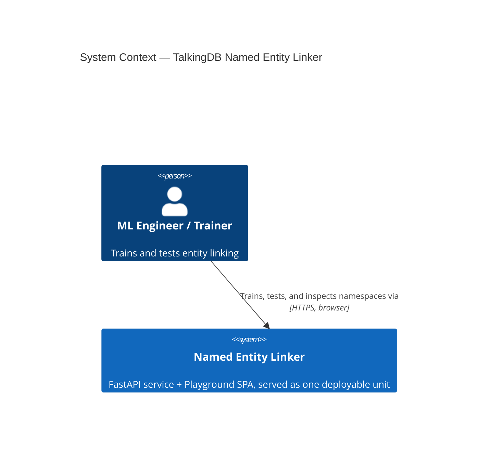
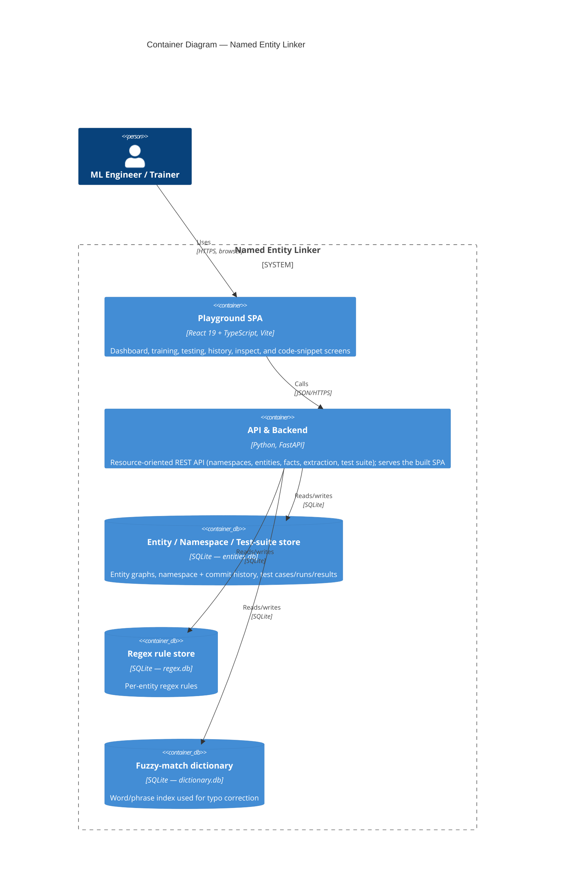
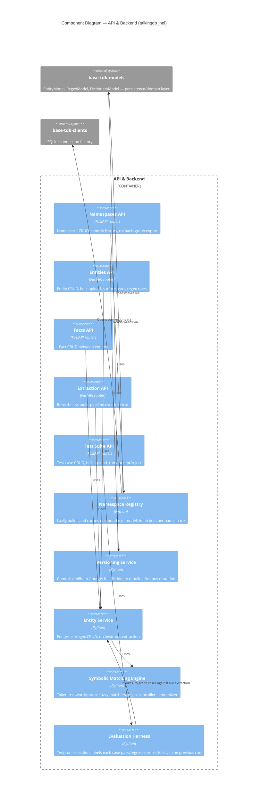

# Architecture (C4 model)

These diagrams follow the [C4 model](https://c4model.com): **Context** (who uses the system and what it talks to), **Container** (the separately-runnable pieces it's built from), and **Component** (what one of those containers is made of internally). They're written as [Mermaid](https://mermaid.js.org/syntax/c4.html) - plain text, rendered natively wherever GitHub shows this file, no build step. For *why* a given box or boundary looks the way it does, see [`docs/adrs/`](../adrs/README.md).

## Level 1 — System Context

No other system calls this service's API at runtime today - checked against every sibling repo in this workspace. It's used exclusively through its own bundled Playground UI right now; this diagram should gain a second `System_Ext` box the day a real external consumer shows up, not before.

## Level 2 — Containers

The SPA is built ahead of time and committed, then served by the same FastAPI process - one deployable unit, two runtimes ([ADR-0002](../adrs/0002-serve-playground-spa-from-fastapi.md)). Each store is a single shared connection reused by every namespace; isolation is by row-key prefix, not separate files per namespace ([ADR-0003](../adrs/0003-namespace-isolation-via-bundle-registry.md)). `entities.db` backs three otherwise-unrelated concerns (entity graphs, namespace/commit history, and the evaluation harness) in one file - a real seam, not an oversight.

## Level 3 — Components (API & Backend)

The Symbolic Matching Engine groups several files (`tokenizer.py`, `matcher/word.py`, `matcher/phrase.py`, `regex.py`, `lemmatizer.py`, `notag.py`, `distance.py`) into one component - the tokenize→match→correct pipeline is one architectural unit, not five. Namespace Registry, Versioning, and the fuzzy-dictionary rebuild strategy are covered by [ADR-0003](../adrs/0003-namespace-isolation-via-bundle-registry.md), [ADR-0004](../adrs/0004-snapshot-based-namespace-versioning.md), and [ADR-0005](../adrs/0005-full-rebuild-of-fuzzy-match-dictionary.md); the Evaluation Harness's run-history model is [ADR-0006](../adrs/0006-eval-harness-retains-full-run-history.md).
